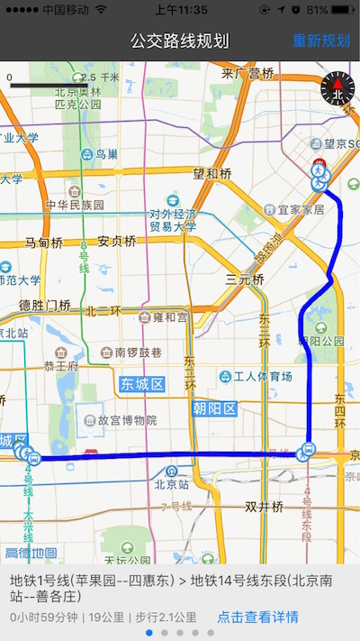
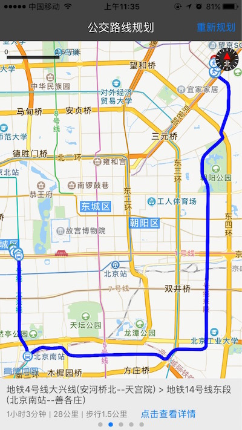
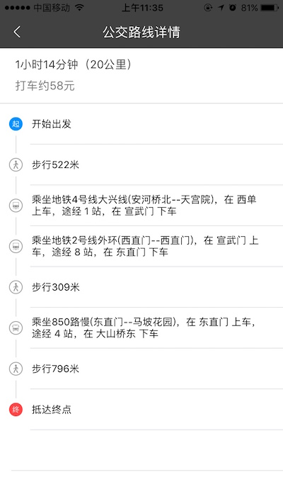

# iOS-traffic-transfer
公交换乘:在地图页面上，固定起点和终点，规划出公交路线，通过详情，进行列表的详情展示.

## 前述 ##

- 工程是基于iOS 3D地图SDK实现的
- [高德官方网站申请key](http://lbs.amap.com/api/ios-sdk/guide/create-project/get-key/#t1).
- 阅读[公交出行路线规划](http://lbs.amap.com/api/ios-sdk/guide/route-plan/bus/#import-header).
- 查阅[参考手册](http://a.amap.com/lbs/static/unzip/iOS_Map_Doc/AMap_iOS_API_Doc_3D/index.html).

## 使用方法 ##

- 运行demo请先执行pod install --repo-update 安装依赖库，完成后打开.xcworkspace 文件
- 如有疑问请参阅[自动部署](http://lbs.amap.com/api/ios-sdk/guide/create-project/cocoapods/).

## demo运行效果图 ##





## 核心类／接口 ##

| 类    | 接口  | 说明   |
| -----|:-----:|:-----:|
| AMapSearchDelegate | 	- (void)onRouteSearchDone:(AMapRouteSearchBaseRequest *)request response:(AMapRouteSearchResponse *)response | 路径规划查询完成回调 |
| MAMapViewDelegate | - (MAOverlayRenderer *)mapView:(MAMapView *)mapView rendererForOverlay:(id<MAOverlay>)overlay | 地图上覆盖物的渲染的回调，可以设置路径线路的宽度，颜色等 |
| MAMapViewDelegate | - (MAAnnotationView *)mapView:(MAMapView *)mapView viewForAnnotation:(id<MAAnnotation>)annotation | 地图上的起始点，终点，拐点的标注的回调，可以自定义图标展示等 |

## 核心难点 ##

```
//在地图上显示当前选择的路径
- (void)presentCurrentRouteCourse {

    if (self.routeArray.count <= 0) {
        return;
    }

    [self.naviRoute removeFromMapView];  //清空地图上已有的路线

    AMapGeoPoint *startPoint = [AMapGeoPoint locationWithLatitude:self.startAnnotation.coordinate.latitude longitude:self.startAnnotation.coordinate.longitude]; //起点

    AMapGeoPoint *endPoint = [AMapGeoPoint locationWithLatitude:self.destinationAnnotation.coordinate.latitude longitude:self.destinationAnnotation.coordinate.longitude];  //终点

    //根据已经规划的换乘方案，起点，终点，生成显示方案
    self.naviRoute = [MANaviRoute naviRouteForTransit:self.route.transits[self.currentRouteIndex] startPoint:startPoint endPoint:endPoint];

    [self.naviRoute addToMapView:self.mapView];  //显示到地图上

    UIEdgeInsets edgePaddingRect = UIEdgeInsetsMake(RoutePlanningPaddingEdge, RoutePlanningPaddingEdge, RoutePlanningPaddingEdge, RoutePlanningPaddingEdge);

    //缩放地图使其适应polylines的展示
    [self.mapView setVisibleMapRect:[CommonUtility mapRectForOverlays:self.naviRoute.routePolylines] edgePadding:edgePaddingRect animated:YES];
}


//根据transit的具体字段，显示信息
- (void)setUpViewsWithData {

    NSInteger hours = self.transit.duration / 3600;
    NSInteger minutes = (NSInteger)(self.transit.duration / 60) % 60;
    self.timeInfoLabel.text = [NSString stringWithFormat:@"%u小时%u分钟（%u公里）",(unsigned)hours,(unsigned)minutes,(unsigned)self.transit.distance / 1000];
    self.taxiCostInfoLabel.text = [NSString stringWithFormat:@"打车约%.0f元",self.route.taxiCost];

    self.routeDetailDataArray = @[].mutableCopy;
    [self.routeDetailDataArray addObject:@{RoutePathDetailStepInfoImageName : @"start",RoutePathDetailStepInfoText : @"开始出发"}]; // 图片的名字，具体步骤的文字信息

    for (AMapSegment *segment in self.transit.segments) {
        AMapRailway *railway = segment.railway; //火车
        AMapBusLine *busline = [segment.buslines firstObject];  // 地铁或者公交线路
        AMapWalking *walking = segment.walking;  //搭乘地铁或者公交前的步行信息

        if (walking.distance) {
            NSString *walkInfo = [NSString stringWithFormat:@"步行%u米",(unsigned)walking.distance];
            [self.routeDetailDataArray addObject:@{RoutePathDetailStepInfoImageName : @"walkRoute",RoutePathDetailStepInfoText : walkInfo}];
        }

        if (busline.name) {
            NSString *busImageName = @"busRoute";
            if ([busline.type isEqualToString:@"地铁线路"]) { //区分公交和地铁
                busImageName = @"underGround";
            }

            //viaBusStops途径的公交车站的数组，如需具体站名，可解析。
            NSString *busInfoText = [NSString stringWithFormat:@"乘坐%@，在 %@ 上车，途经 %u 站，在 %@ 下车",busline.name,busline.departureStop.name,(unsigned)(busline.viaBusStops.count + 1),busline.arrivalStop.name];
            [self.routeDetailDataArray addObject:@{RoutePathDetailStepInfoImageName : busImageName,RoutePathDetailStepInfoText : busInfoText}];

        } else if (railway.uid) {
            [self.routeDetailDataArray addObject:@{RoutePathDetailStepInfoImageName : @"railwayRoute",RoutePathDetailStepInfoText : railway.name}];
        }
    }

    [self.routeDetailDataArray addObject:@{RoutePathDetailStepInfoImageName : @"end",RoutePathDetailStepInfoText : @"抵达终点"}];

}

```

